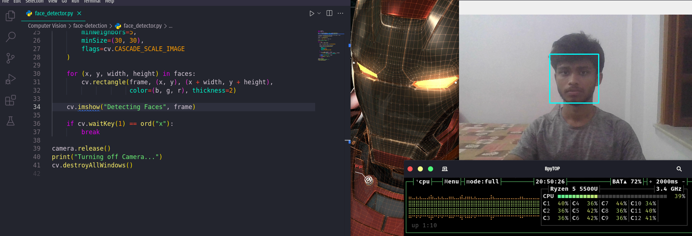

<h1>Real-Time Face Detection</h1>
    
This repository contains a Python script for real-time face detection using OpenCV. The script captures video from the webcam, detects faces in the video frames, and displays the video with rectangles drawn around detected faces.

    
<h2>Project Overview</h2>
    
The script uses OpenCV's pre-trained Haar Cascade classifier for face detection. The classifier is applied to each frame captured from the webcam, and detected faces are highlighted with rectangles.

    
<h2>Features</h2>
    <ul>
        <li>Real-time face detection using the webcam</li>
        <li>Displays video with detected faces highlighted</li>
        <li>Simple and intuitive command-line interface</li>
    </ul>
    
<h2>Prerequisites</h2>
    
Python 3.x

    
OpenCV library

    
<h2>Installation</h2>
    
Clone the repository to your local machine:

    <pre><code>
    git clone https://github.com/Dark-Programer/real-time-face-detection.git
    cd real-time-face-detection
    </code></pre>
    

Create a virtual environment and activate it (optional but recommended):

    <pre><code>
    python -m venv venv
    source venv/bin/activate   # On Windows use `venv\Scripts\activate`
    </code></pre>
    

Install the required packages:

    <pre><code>
    pip install opencv-python
    </code></pre>
    
<h2>Usage</h2>
    
Run the Python script:

    <pre><code>
    python face_detector.py
    </code></pre>
    

The script will start the webcam and begin detecting faces in real-time. Press 'x' to exit the application.

    
<h2>Files</h2>
    <ul>
        <li><strong>face_detector.py</strong>: Contains the face detection script.</li>
    </ul>
    
<h2>How It Works</h2>
    <ul>
        <li>The script loads the Haar Cascade classifier for face detection from the OpenCV data folder.</li>
        <li>The webcam is activated, and frames are captured in a loop.</li>
        <li>Each frame is converted to grayscale for face detection.</li>
        <li>The classifier is used to detect faces in the grayscale frame.</li>
        <li>Rectangles are drawn around detected faces and displayed in the video window.</li>
        <li>Press 'x' to exit the application and release the webcam.</li>
    </ul>
    
<h2>Screenshots</h2>
        
    
<h2>Author</h2>
    
Arka Chakraborty
